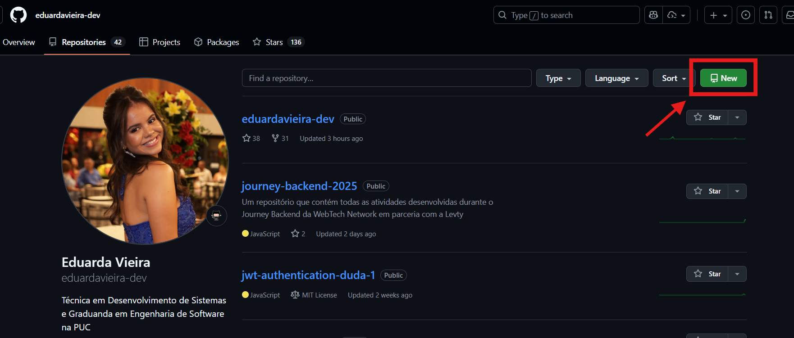
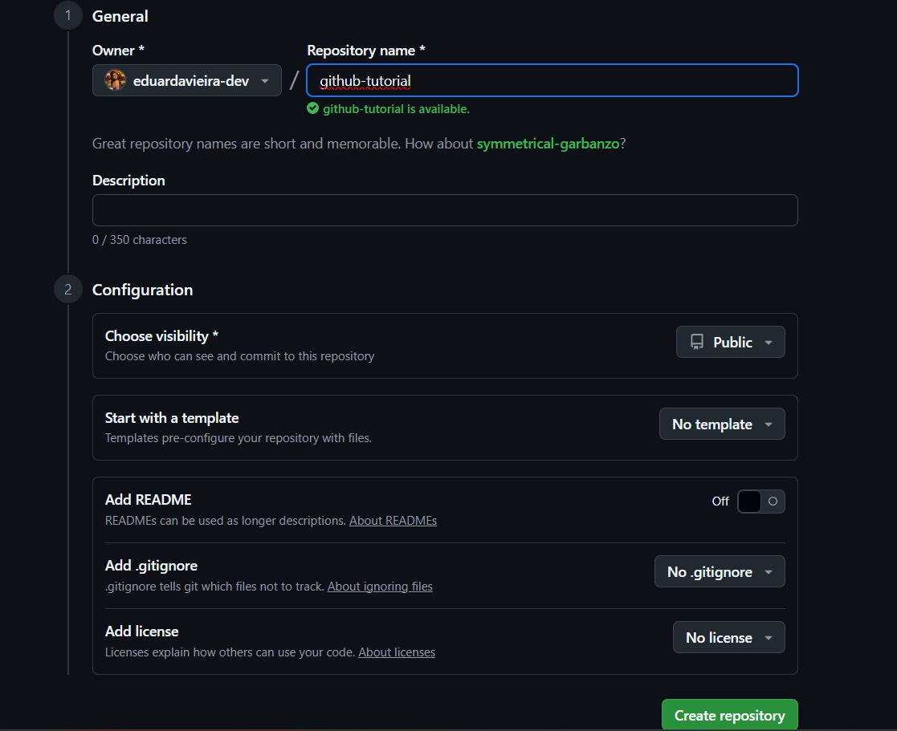
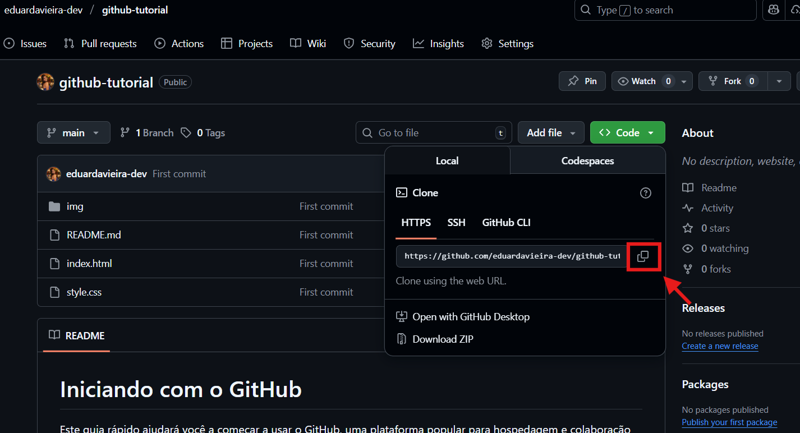

# Iniciando com o GitHub

Este guia rápido ajudará você a começar a usar o GitHub, uma plataforma popular para hospedagem e colaboração em projetos de software.

Para começar a usar o GitHub, você precisará de:

1. **Uma conta no GitHub**: Acesse [github.com](https://github.com) e crie uma conta gratuita.
2. **Git instalado**: Instale o Git em sua máquina. Você pode baixar o instalador em [git-scm.com](https://git-scm.com/).
3. **Conhecimento básico de Git**: Familiarize-se com os comandos básicos do Git, como `git init`, `git add`, `git commit`, `git push`, `git pull` entre outros.
4. **Um projeto para versionar**: Tenha um projeto em mente que você gostaria de versionar e compartilhar no GitHub.

O GitHub é uma plataforma que permite você hospedar e gerenciar seus projetos de forma colaborativa, facilitando o trabalho em equipe e o controle de versões.

## Criando e Enviando um Novo Projeto para o GitHub

1. **Crie um novo repositório no GitHub**:

   - Acesse [github.com](https://github.com)
   - Clique em "New" ou "+" no canto superior direito
     
   - Dê um nome ao seu repositório
   - Escolha se será público ou privado
   - NÃO inicialize com README, .gitignore ou licença
     

2. **Crie um repositório local**: No seu computador, crie uma pasta para o projeto e inicialize um repositório Git:

   ```
   git init
   ```

3. **Adicione arquivos ao projeto**:

   - Crie ou copie os arquivos do seu projeto para a pasta
   - Adicione os arquivos ao controle de versão:

   ```
   git add .
   git status  # Verifique os arquivos adicionados
   ```

4. **Faça o primeiro commit**:

   ```
   git commit -m "Primeiro commit: Inicialização do projeto"
   ```

5. **Conecte ao GitHub**:
   ```
   git remote add origin https://github.com/seu-usuario/seu-repositorio.git
   ```
6. **Envie suas alterações**:
   ```
   git branch -M main # Renomeia a branch principal para main
   git push -u origin main
   ```

## Clonando e Contribuindo com Projetos Existentes

1. **Clone o repositório**:

   - Encontre o repositório no GitHub
   - Clique no botão "<>Code" e copie a URL
     
   - Clone localmente:

   ```bash
   git clone https://github.com/usuario/repositorio.git
   ```

2. **Faça suas alterações**:

   - Modifique os arquivos necessários
   - Adicione e commit as mudanças:

   ```bash
   git add .
   git commit -m "Descrição das alterações realizadas"
   ```

3. **Envie suas alterações**:

   ```bash
   git push
   ```

## Comandos Git Essenciais

| Comando        | Descrição                                           | Exemplo                                         |
| -------------- | --------------------------------------------------- | ----------------------------------------------- |
| `git init`     | Inicializa um novo repositório Git                  | `git init`                                      |
| `git clone`    | Clona um repositório remoto                         | `git clone https://github.com/usuario/repo.git` |
| `git add`      | Adiciona arquivos ao staged                         | `git add .` ou `git add arquivo.txt`            |
| `git status`   | Mostra o estado atual do repositório                | `git status`                                    |
| `git commit`   | Registra as alterações no repositório               | `git commit -m "mensagem"`                      |
| `git push`     | Envia alterações para o repositório remoto          | `git push origin main`                          |
| `git pull`     | Atualiza o repositório local com alterações remotas | `git pull origin main`                          |
| `git branch`   | Lista, cria ou exclui branches                      | `git branch nova-branch`                        |
| `git checkout` | Muda para outra branch                              | `git checkout main`                             |
| `git merge`    | Une duas branches                                   | `git merge feature`                             |
| `git log`      | Mostra o histórico de commits                       | `git log`                                       |
| `git remote`   | Gerencia conexões com repositórios remotos          | `git remote add origin URL`                     |

## Recursos Adicionais

- [GitFluence](https://www.gitfluence.com/)
- [Principais comandos Git](https://comandosgit.github.io/)
-  Extensão para Git e GitHub:  `GitLens — Git supercharged`